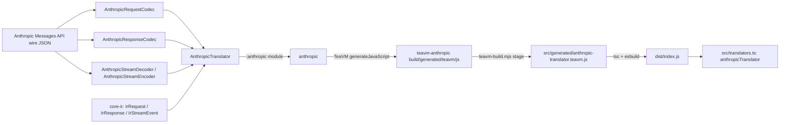

# anthropic-translator

[](https://www.npmjs.com/package/anthropic-translator)
[](https://www.npmjs.com/package/anthropic-translator)

Anthropic wire-format translator for the intisy-ai AI-proxy ecosystem.

Anthropic Messages API vendor translator for the canonical IR (internal representation) used
across the intisy AI-tooling ecosystem. Java + TeaVM single-source, so the exact same request,
response, and streaming codecs compile to a JVM jar and to a JS module: any front-door or provider
that needs to speak Anthropic's wire format converts it to and from `core-ir`'s neutral IR through
one shared, tested implementation instead of a bespoke per-app reimplementation.

## Under-the-Hood Architecture



`AnthropicTranslator` implements `core-ir`'s `Translator` SPI: `decodeRequest`/`encodeRequest`,
`decodeResponse`/`encodeResponse`, and stateful `newStreamDecoder()`/`newStreamEncoder()` for true
streaming (no buffer-and-reconvert). The `:anthropic` module holds the codecs and is
zero-dependency, Java-8-clean; `:teavm-anthropic` is the TeaVM export surface over `:anthropic` and
core-ir's `:ir` module, transpiled to a single JS bundle. The TS surface (`anthropicTranslator`)
is a thin async wrapper over that generated JS, so callers never touch the TeaVM handle directly.

## Structure

- `src/index.ts` - `loadAnthropicTranslator()`, a lazily-memoized dynamic import of the TeaVM ESM
  bundle, plus the public barrel re-exporting `translators.ts` and `core-ir`'s IR types.
- `src/translators.ts` - the public, typed TS API: `anthropicTranslator`, with
  `decodeRequest`/`encodeRequest`/`decodeResponse`/`encodeResponse` (thin async wrappers over the
  TeaVM exports) and `decodeStream()`/`encodeStream()`, which return a real `TransformStream`
  driven chunk-by-chunk by the stateful Java handle.
- `src/driver.ts` - a small CLI driver (`node dist/driver.js <payload.json>`) that decodes a wire
  request to IR and re-encodes it, useful for manual smoke checks.
- `src/generated/anthropic-translator.teavm.d.ts` - hand-authored ambient types for the staged JS
  (the `.js` itself is gitignored build output).
- `src/__tests__/` - `smoke.test.ts` (toolchain round trip) and `translators.test.ts` (request and
  streamed-response round trips through the `TransformStream` helpers).
- `anthropic/` - the Anthropic codecs (`AnthropicRequestCodec`, `AnthropicResponseCodec`,
  `AnthropicStreamDecoder`, `AnthropicStreamEncoder`, `AnthropicBlockCodec`, `AnthropicUsageCodec`,
  `AnthropicStopReason`, `AnthropicJsonUtil`) plus `AnthropicTranslator`, the `Translator`
  implementation that ties them together. Depends on core-ir's `:ir` module for the
  IR types and the codec SPI.
- `teavm-anthropic/` - the TeaVM JS export surface (`AnthropicTranslatorJs`), transpiling
  `:anthropic` and `:ir` to `anthropic-translator.js`.
- `settings.gradle` / `build.gradle` / `gradlew*` - self-contained Gradle build
  (Java 8 for `:anthropic`, Java 17 override for `:teavm-anthropic`), declaring core-ir's `:ir`
  module as a github-gradle coordinate.

## Installation

TypeScript, as a published npm package:

```bash
npm install @intisy-ai/anthropic-translator
```

Java, as a `github-gradle` coordinate resolving this repo's released `:anthropic` jar:

```groovy
githubImplementation "intisy-ai:anthropic-translator:1.1.0:anthropic"
```

No checkout of this repo or of `core-ir` is needed, or wanted: a nested checkout is a third
resolver beside the package manifest and the build file, and it can disagree with both.

## Usage

```ts
import { anthropicTranslator } from "anthropic-translator";

const ir = await anthropicTranslator.decodeRequest(wireJson);
const backToWire = await anthropicTranslator.encodeRequest(ir);

const response = await anthropicTranslator.decodeResponse(responseWireJson);
const wireResponse = await anthropicTranslator.encodeResponse(response);

const decodeStream = await anthropicTranslator.decodeStream();
const irEvents = upstreamSseBody.pipeThrough(decodeStream); // ReadableStream<IrStreamEvent>

const encodeStream = await anthropicTranslator.encodeStream();
const wireSse = irEventStream.pipeThrough(encodeStream); // ReadableStream<string>
```

`anthropicTranslator` satisfies `core-ir`'s `VendorTranslator` interface, so any front-door that
already speaks that interface for another vendor can adopt Anthropic support by swapping in this
translator.

## Testing

Java: `cd java && ./gradlew test` (JUnit 5, `:anthropic` module: request, response, and streaming
round-trip tests against fixture payloads).

TS: `npm run build && npx vitest run` (`build` stages the TeaVM JS, `tsc`s, then bundles with
esbuild; `test` round-trips the translator from TS, including a full streamed response through the
`TransformStream` helpers). Both layers use the same round-trip fixture approach: a captured
Anthropic wire payload decoded to IR and re-encoded, asserting the result matches the original
shape rather than a byte-identical string.

## License

[](LICENSE)
